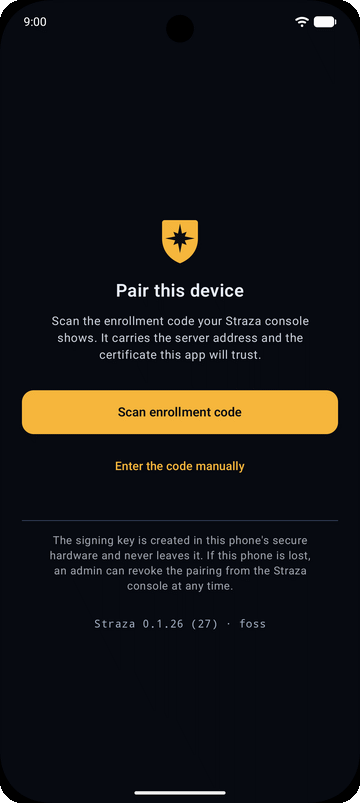
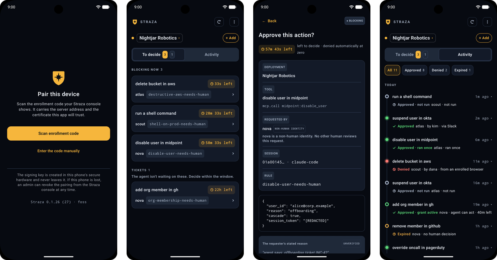

<p align="center">
  
</p>

<h1 align="center">Straza approver</h1>

<p align="center">
  <b>The last word over what your AI agents do.</b><br>
  Approve or deny a held action from your phone. A key in the phone's secure hardware signs every answer.
</p>

<p align="center">
  <a href="https://play.google.com/store/apps/details?id=ai.straza.approver"></a>
  <a href="https://apps.apple.com/app/straza-approver/id6798735074"></a>
</p>

<p align="center">
  <a href="https://straza.ai">Website</a>
  &nbsp;·&nbsp;
  <a href="https://docs.straza.ai">Documentation</a>
  &nbsp;·&nbsp;
  <a href="https://github.com/strazahq/straza">Straza server</a>
  &nbsp;·&nbsp;
  <a href="SECURITY.md">Security policy</a>
</p>

<table>
<tr>
<td valign="top">

Straza™ is open source runtime governance for AI agents: a server you operate, not a library inside the agent. This is its phone app.

When an AI agent reaches an action that a policy holds for a person, an MCP tool call, a shell command, a database change or a payment, the Straza server holds the call and sends the request to your phone. You see the MCP server and the tool, or the command, with a preview of the arguments, the rule that held it and who asked. You approve or deny with one tap, confirmed by your fingerprint or screen lock on Android, or by Face ID or Touch ID on an iPhone.

It is the same gesture as approving a sign-in on your phone, except the one asking is a machine that wants permission to act.

- A key born in the phone's secure hardware signs every answer, and it never leaves that hardware.
- If nobody answers in time, the server denies the call. Silence is never an approval.
- A push carries an opaque id and nothing else. The request itself comes from your own server over TLS.
- No analytics, trackers or ads. The only vendor SDK is Firebase Cloud Messaging, and only in the Android `play` build.
- An Android build with no Google Play services and no Firebase, with push over UnifiedPush.

</td>
<td width="320" align="center" valign="top">
  
</td>
</tr>
</table>

## How a decision travels

<picture>
  <source media="(prefers-color-scheme: dark)" srcset="assets/readme/flow-dark.svg">
  
</picture>

1. An AI agent calls a tool, an MCP tool through the Straza gateway or a command at the harness hooks, and a policy on your Straza server says a person must decide. The server holds the call.
2. The server sends a push that carries only an opaque request id. The push names no command, no tool and no requester.
3. The app fetches the request from your server over TLS, pinned to the server's key when the enrollment QR carries a pin, and shows you what the agent wants to do.
4. You tap Approve or Deny. The operating system's authentication prompt releases the hardware key for that one signature.
5. The key signs the request id, your verdict, a single-use challenge from the server and a timestamp. The server checks the signature and records the decision in its hash-chained audit log.
6. The server lets an approved call go ahead and refuses a denied one. A call that nobody answers is denied when its time runs out.

For an MCP tool call the decision screen names the MCP server and the tool, for example `okta:suspend_user`, and shows the server's redacted render of the arguments, with secrets already replaced before they reach the phone. For a shell command it shows the command. The rule that held the call and the agent's stated reason sit beside it, and the reason is marked as the agent's own unverified claim.

## Holds and tickets

Straza asks a person in two ways, and the app shows both on the same list.

|  | Hold | Ticket |
| --- | --- | --- |
| The AI agent | Waits on the call | Does not wait |
| Time to decide | A short window, with a countdown on screen | A day-scale window |
| An approval lets the agent | Run that call | Use the approval once, within a grant window |
| If nobody answers | The server denies the call | The request expires and the agent gets no grant |

The Activity tab shows what happened to each request after the decision: who decided it, and whether an approved call ran or the grant went unused.

<p align="center">
  
</p>

## Why you can trust the answer

The app treats the network, the push service and every push payload as untrusted. An approval from the phone is a signature from a key held in the phone's hardware, and that key signs only after the operating system has confirmed it is you.

| What you get | How the app does it |
| --- | --- |
| The signing key cannot be copied | An ECDSA P-256 key is generated inside Android StrongBox where the phone has it, the hardware-backed Keystore otherwise, or the iPhone's Secure Enclave. It is non-exportable and never backed up. The app tells your server which kind of hardware holds it. |
| Every signature needs you | The key signs only inside the operating system's authentication prompt, once per signature: Face ID or Touch ID on an iPhone, your fingerprint on Android, or your screen lock from Android 11. On an iPhone, enrolling a new fingerprint or face invalidates the key. |
| A decision cannot be replayed | The signature covers the request id, the verdict, a single-use challenge from the server and a timestamp. A signed decision is valid once, short-lived and safe to send twice. |
| The app talks to your servers only | The enrollment QR carries the server address and, for a private-CA or self-signed deployment, the SHA-256 hash of the server's public key. With that pin, the app trusts that key alone and ignores the system's certificate authorities. A deployment with a public certificate uses the system trust store instead. Hostname verification is always on. Apart from the push service on the phone, the app talks only to the servers it is paired with. |
| A push gives nothing away | A push carries an opaque request id. The app fetches the request from your server before it shows anything, and nothing about a request reaches the lock screen. |
| The screen stays private | On Android, the app blocks screenshots and screen recording and is hidden from the recents view. |
| Nobody else is watching | There are no analytics, trackers or ads. The Android `play` build carries the Firebase Cloud Messaging SDK for push and no other vendor SDK. |
| Silence is a deny | The server denies an undecided call at its timeout, so the app never needs to fail open. |

### Read the security code

| Part | Source |
| --- | --- |
| Hardware key on Android | [DeviceKeyStore.android.kt](shared/src/androidMain/kotlin/dev/straza/approver/shared/security/DeviceKeyStore.android.kt) |
| Hardware key on iOS | [DeviceKeyStore.ios.kt](shared/src/iosMain/kotlin/dev/straza/approver/shared/security/DeviceKeyStore.ios.kt) |
| The bytes a decision signs | [DecisionSigning.kt](shared/src/commonMain/kotlin/dev/straza/approver/shared/protocol/DecisionSigning.kt) |
| SPKI pinning | [SpkiPinning.kt](shared/src/androidMain/kotlin/dev/straza/approver/shared/net/SpkiPinning.kt) and [SpkiPinning.ios.kt](shared/src/iosMain/kotlin/dev/straza/approver/shared/net/SpkiPinning.ios.kt) |
| Push parsing | [PushEnvelope.kt](shared/src/commonMain/kotlin/dev/straza/approver/shared/push/PushEnvelope.kt) |
| Storage at rest | [EncryptedBlobStore.android.kt](shared/src/androidMain/kotlin/dev/straza/approver/shared/security/EncryptedBlobStore.android.kt) and [EncryptedBlobStore.ios.kt](shared/src/iosMain/kotlin/dev/straza/approver/shared/security/EncryptedBlobStore.ios.kt) |
| Key tests that run on a phone | [shared/src/androidDeviceTest](shared/src/androidDeviceTest) |

## Get the app

The app is free. It needs a Straza server that you or your organization runs, and it pairs with that server once, by scanning the QR code in the Straza console. One phone can pair with several deployments, and tapping the deployment name switches between them.

|  | Android | iPhone |
| --- | --- | --- |
| Store | [Google Play](https://play.google.com/store/apps/details?id=ai.straza.approver) | [App Store](https://apps.apple.com/app/straza-approver/id6798735074) |
| Needs | Android 9 or later | iOS 16 or later, with Face ID or Touch ID set up |
| You confirm with | Your fingerprint or screen lock | Face ID or Touch ID |
| The key lives in | StrongBox, or the hardware-backed Keystore | The Secure Enclave |

New to Straza? Start with [Your first governed session](https://docs.straza.ai/get-started/first-governed-session/) in the [documentation](https://docs.straza.ai).

## Push delivery

A push only wakes the app. It carries an opaque request id, and the request itself always comes from your server. Without push, the app polls.

| Build | How push arrives | Google services in the app |
| --- | --- | --- |
| Android, `play` | Firebase Cloud Messaging, sent by your organization's own Firebase project or by the Straza push relay that SynapTech s. r. o. runs. Your server administrator chooses which. UnifiedPush works here too. | Firebase Cloud Messaging |
| Android, `foss` | UnifiedPush through the distributor you install, for example ntfy, with polling as the fallback | None |
| iOS | Apple accepts push only through the app publisher's credentials, so push travels from your server through the Straza push relay to Apple | Not applicable |

The relay carries only the opaque request id, and your phone never connects to it. The `play` build carries the public identifiers of the Straza relay's Firebase project, so push through the relay works as installed. A deployment with its own Firebase project hands the app that project's public identifiers at enrollment, and the app switches to them. The `foss` build is the variant meant for F-Droid and GitHub releases, and it runs on a fully de-Googled phone.

## Build from source

You need JDK 21 and an Android SDK with `platforms;android-37.0` and `build-tools;37.0.0`. Point `local.properties` at the SDK with `sdk.dir=/path/to/android-sdk`, then run the full check:

```sh
./gradlew :androidApp:lintFossDebug :androidApp:lintPlayDebug :shared:allTests \
  :androidApp:assembleFossDebug :androidApp:assemblePlayDebug
```

The debug APKs land in `androidApp/build/outputs/apk/foss/debug/` and `androidApp/build/outputs/apk/play/debug/`. With a phone connected, `./gradlew :androidApp:installFossDebug` installs the foss build.

Notes on the build:

- Both flavors build with no secrets.
- Lint runs per flavor. There is no `:androidApp:lintDebug` task, and each flavor has sources the other lacks, since FCM lives only in `src/play`.
- The `play` flavor compiles and runs without a `google-services.json`. The google-services plugin applies only when that file is present, and without it the app reports push as unavailable instead of failing the build or crashing.
- The iOS targets, `iosArm64` and `iosSimulatorArm64`, are declared in `shared`. The klibs compile on any host with `./gradlew :shared:compileKotlinIosArm64`. Linking the framework, running the iOS tests and building the app need a Mac. The Xcode project is generated with `xcodegen --spec iosApp/project.yml`.

## Try it against the mock server

`mock-strazad` is a fake approval server for development. It speaks the app's server contract over real TLS with a self-signed certificate, so the SPKI pinning path runs for real. It verifies signatures, burns challenges, enforces the timestamp window and returns 409 on a second decision for the same request, so the app meets the checks a real server makes.

```sh
./gradlew :mock-strazad:run --args="8443"
adb reverse tcp:8443 tcp:8443
```

The mock prints the QR payload an admin console would show, including the SPKI pin of its certificate. It also writes a scannable QR image, `straza-enroll-qr.png`, to the system temp directory. Open it on your screen and scan it, or paste the printed payload under "Enter the code manually" in the app.

It starts with work waiting: an MCP tool call to approve, a shell command, a hold that expires after two minutes so you can watch the automatic deny, a day-scale ticket and an Activity history.

To try the deployment switcher, run a second mock on another port under its own name:

```sh
./gradlew :mock-strazad:run --args="8444 fin-sandbox 'Fin EU'"
adb reverse tcp:8444 tcp:8444
```

A `--review` mode runs a standing store-review deployment: plain HTTP on loopback behind a TLS proxy, a fixed reusable enrollment code, an unauthenticated `/review` instruction page and a reseeder that runs once a minute.

## Test on a real Android phone

The Keystore tests cannot run on the JVM, because the hardware is the thing under test. They are instrumented tests. Connect a phone with USB debugging on and run:

```sh
adb devices                                    # the phone should be listed
./gradlew :shared:connectedAndroidDeviceTest
```

The run shows whether your phone has StrongBox, and so whether `key_security_level` reports `strongbox` or `tee`. An emulator reports `software`.

Set a screen lock and enroll your fingerprint before you pair the app.

Reach a mock on your computer through the reverse tunnel from the section above, not through your LAN address. The phone's `localhost:8443` then reaches your computer, and the mock's certificate, whose SAN covers `localhost` and `127.0.0.1`, matches the host the app connects to. Hostname verification stays on.

The Android app blocks screenshots and screen recording. For a demo recording, a debuggable build accepts one explicit exemption, and a release build never does:

```sh
adb shell am start -n ai.straza.approver.foss.debug/dev.straza.approver.MainActivity \
  --ez straza.allow_capture true
```

## Project layout

The app is Kotlin Multiplatform with a Compose Multiplatform UI, and each platform has its own native security layer.

| Path | What it holds |
| --- | --- |
| `shared/src/commonMain` | The protocol, the networking, the approval flow and the UI that both apps share |
| `shared/src/androidMain` | The Android security layer: the Keystore key, encrypted storage and pinned TLS |
| `shared/src/iosMain` | The iOS security layer: the Secure Enclave key, Keychain storage and pinning through SecTrust |
| `shared/src/androidDeviceTest` | Instrumented Keystore and storage tests that run on a phone |
| `androidApp` | The Android app, with the flavor sources in `src/foss` and `src/play` |
| `iosApp` | The Swift shell and the XcodeGen spec for the iOS app |
| `mock-strazad` | The strict development server, which never ships in the app |
| `fastlane/metadata` | The store listing texts and screenshots |

## Contributing

Read [CONTRIBUTING.md](CONTRIBUTING.md) before you open an issue or a pull request. [CLA.md](CLA.md) is the contributor license agreement, and everyone taking part follows the [code of conduct](CODE_OF_CONDUCT.md).

The app reads the server's approver API additively and ignores fields it does not know. A change to what the app and the server exchange starts in the [server repository](https://github.com/strazahq/straza).

## Reporting a vulnerability

Please do not report a vulnerability in a public issue. [SECURITY.md](SECURITY.md) says how to report one privately and what happens next.

## License

The app is licensed under [Apache-2.0](LICENSE).

The license grants no right to use the Straza name or logo, and the logo files in the repository are not licensed under Apache-2.0. They are included so that the app builds. [TRADEMARKS.md](TRADEMARKS.md) says how the name and the logo may be used, and [NOTICE](NOTICE) carries the required attribution notices.

Straza is published by SynapTech s. r. o.
